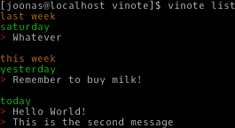

# vinote

Vinote is my minimal memo/diary tool. It can add notes to the diary or view them, ordered by date. And it looks gorgeous!

The tool uses an sqlite3 database as its backend. Personally, I use it through ssh so I can add and list notes from anywhere. For this feature, I have the following alias in my .bashrc: 

`alias vinote='ssh -qt server_ip python vinote.py'`

And then to add notes from anywhere I can do

`vinote`

and it will open up $EDITOR.

Or I can view list of notes via

`vinote list`

